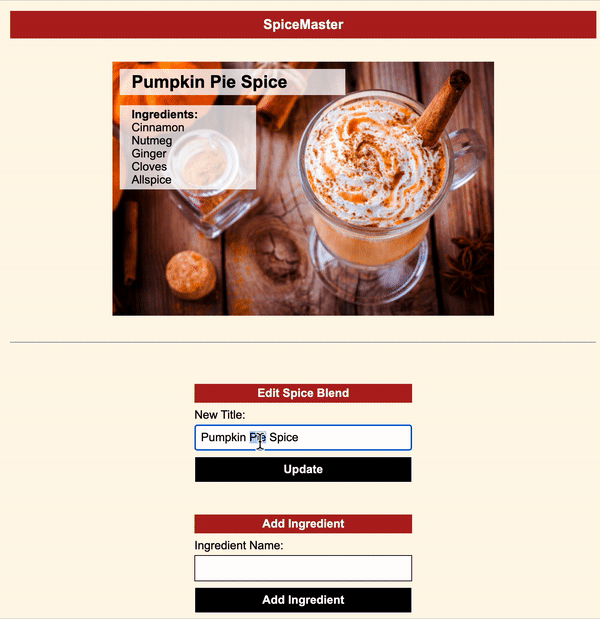
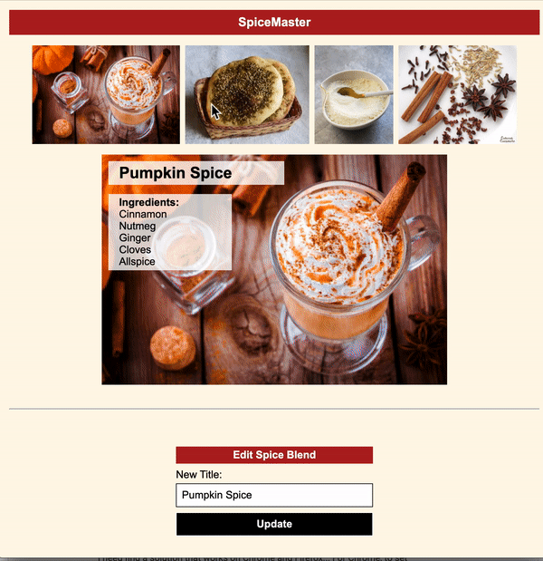

# Phase 3 Mock Code Challenge: SpiceMaster

Today you'll be building an app for creating spice blend recipes. You will be using a local API and building out the frontend for our app.

## Demo

Use this gif as an example of how the core deliverables for the app should work.



## Setup

- Run `json-server --watch db.json --routes routes.json` to get the backend started
- Open the `index.html` file on your browser
- Write your code in the `index.js` file

## API Endpoints

Your base URL for your API will be: http://localhost:3000

The endpoints you will need for the **core deliverables** are:

```
GET /spiceblends/1

# Example Response
{
    "id": 1,
    "title": "Pumpkin Spice",
    "image": "./assets/spices/pumpkinspicelatte.jpg",
    "spices": [
        {
            "id": 1,
            "name": "Cinnamon",
            "spiceblendId": 1
        },
        {
            "id": 2,
            "name": "Nutmeg",
            "spiceblendId": 1
        }
    ]
}
```

```
PATCH /spiceblends/1

# Required Headers
{ 
  "Content-Type": "application/json"
}

# Required Body
{ 
  title: "updated title"
}

# Example Response
{
  "id": 1,
  "title": "updated title",
  "image": "./assets/spices/pumpkinspicelatte.jpg"
}
```

## Core Deliverables

As a user, I can:

- See the first spice blend (the spice blend with an ID of 1), including its **title**, **image**, and list of **ingredients**, when the page loads.
- Update the **title** of the spice blend on the page when the `#update-form` is submitted, and **still see that change when reloading the page** (the new title should be persisted on the server).
- Add a new **ingredient** to the spice blend when the `#ingredient-form` is submitted. The new ingredient should be displayed on the page (no persistence needed for now).

## Advanced Deliverables

These deliverables are not required to pass the code challenge, but if you have the extra time, or even after the code challenge, they are a great way to stretch your skills.

> Note: If you are going to attempt these advanced deliverables, please be sure to have a working commit with all the Core Deliverables first!

Here is a demo of the **advanced deliverables**:



You'll need a these endpoints for the advanced deliverables:

```
POST /ingredients

# Required Headers
{ 
  "Content-Type": "application/json"
}

# Required Body
{ 
  name: "ingredient name",
  spiceblendId: 1
}

# Example Response
{
  "name": "ingredient name",
  "spiceblendId": 1,
  "id": 17
}
```

```
GET /spiceblends

# Example Response
[
  {
    "id": 1,
    "title": "Pumpkin Spice",
    "image": "./assets/spices/pumpkinspicelatte.jpg"
  },
  {
    "id": 2,
    "title": "Za'atar",
    "image": "./assets/spices/zaatar.jpg"
  }
]
```

```
GET /spiceblends/:id

# Example Response
{
  "id": 1,
  "title": "Pumpkin Spice",
  "image": "./assets/spices/pumpkinspicelatte.jpg",
  "spices": [
    {
      "id": 1,
      "name": "Cinnamon",
      "spiceblendId": 1
    },
    {
      "id": 2,
      "name": "Nutmeg",
      "spiceblendId": 1
    }
  ]
}
```

As a user, I can:

- Persist new ingredients to the server when the `#ingredient-form` is submitted. Make sure to follow the format listed above to make a POST request to `/ingredients`. In the body of the request, the `spiceblendId` will need to be a **number** (not a **string**).
- See all spice blend images in the `#spice-images` div when the page loads. Request the data from the server to get all the spice blends. Then, display the image for each of the spice blends using an `img` tag inside the `#spice-images` div.
- Click on an image from the `#spice-images` div and see all the info about that spice blend displayed inside the `#spice-blend-detail` div. You will need to make another GET request with the spice blend's ID to get the information about the spice blend that was clicked.

## Rubric

You can find the rubric for this assessment [here](https://github.com/learn-co-curriculum/se-rubrics/blob/master/module-3.md).
