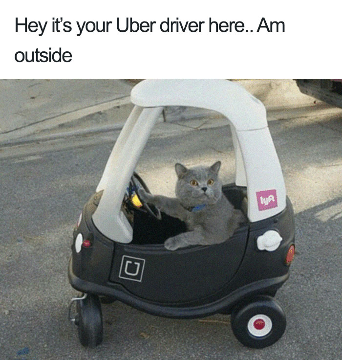
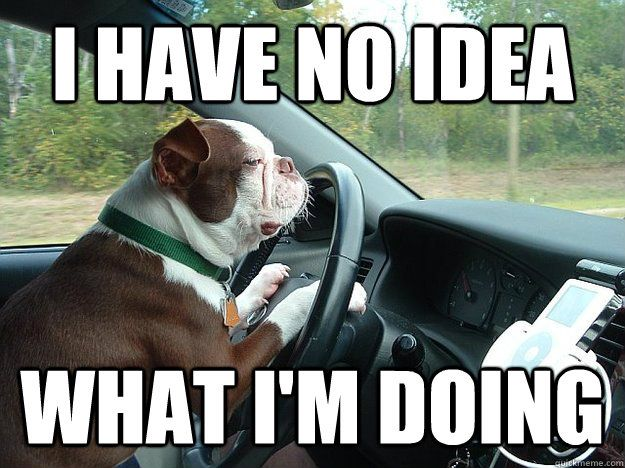
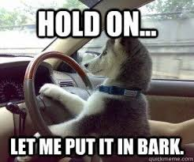

# Many to Many Relationships




#### SWBATs:
* Review one-to-many
  * one object has many objects
  * one object belongs to another object
* Implement both sides of a many to many relationships
  * Object one has many objects through a join
  * Object two has many objects through a join




______

When we think about what entities we want to model in our programs, it's important to think about their relationships to each other. Yesterday, we talked about one to many relationships. 

<details><summary>One to Many</summary>
<p>

    User -< Tweet

    State -< City

    Government -< Citizen

    Company -< Driver

    Team -< Player

    League -< Team -< Player

    Country -< State -< City

    Ceremony -< Particpant -< Award
</p>
</details>


& today, let's talk about many to many! If we think about the Uber or Lyft domain, they have passengers and drivers. A driver can have many passengers and a passenger can have many drivers. A driver might not know about their passenger directly. Likewise, a passenger may not directly know about their driver. The way that a driver will know about their passenger is through the ride. When a driver gets a new ride, they will recieve the information about their passenger. Likewise, whenever a passenger books a new ride, they will recieve some information about their driver.

    Driver -< Ride >- Passenger

    - Driver has many Rides
    - Driver has many Passengers through Rides
    - Passenger has many Rides
    - Passenger has many Drivers through Rides


<br><br>

Another example we can think of is the relationship between doctor and patient entities. A doctor can have many patients and a patient can see many different doctors. A doctor may not know who their patients are directly, but through appointments, they'll know. Likewise, through an appointment, a patient knows information about their doctor.

Doctor -< Appointment >- Patient

The purpose of the class through which the two classes are joined is to store a record for each of the combinations of these other two classes. You can think of this class as a place to store information or attributes of the relationships between the two entities.


<p>
<details>
<summary> What are some other examples of many to many relationships?</summary>
<p>
<ul>
<li>SocialMediaSite -< Account >- User</li>
<li>Student -< Enrollment >- Course </li>
<li>Passenger -< Ride >- Driver </li>
<li>Bus -< Ticket >- Passenger </li>
<li>Landlord -< Property >- Tenenant </li>
<li>NailTechnician -< Appointment >- Customer</li>
<li>Company -< Purchase >- Client</li>
</ul>
</p>
</details>
</p>

___


## Driver -< Ride >- Passenger

#### How can a driver learn about the passengers?
    1. For a driver, find all their rides
    2. For those rides, get the passengers' information

In the Passenger -< Ride >- Driver, we have three classes - `Passenger`, `Ride`, `Driver`. Take a look at the image below. It's a [google sheet](sheets.new) with information about our classes. This is another way to visualize our classes and their attributes. It's also going to help us prepare for learning about databases next week. We display each entity in our domain (passenger, driver, ride). We show how each  entity has certain attributes. For example, our *passenger* object has an *object_id*, *first_name*, *last_name*, and *age*. Each row is an instance of a class. Each object's *object_id* is an attribute that will allow us to uniquely identify an instance. If we are a large corporation with 3,000 drivers and 5 of our drivers are named "Jane Doe", we would easily be able to tell them apart in our code using their unique identifier, *object_id*.


*Driver* has many *Passengers* through *Ride*. *Passenger* has many *Drivers* through *Ride*, too. By examining the attributes of the *Driver* and *Passenger*, we can see that both of them have no direct access to each other without *Ride*. *Ride* knows forms the relationship between the driver and a passenger by by having a reference to an instance of a passenger and a reference to an instance of a driver.


___

### What are the steps we took to create the many to many relationship between a Driver and a Passenger through a Ride?

__1. Create Passenger Class__


- Implement single source of truth
    - `@@all == []`
    - Passenger.all method


__2. Create Driver Class__

- Implement single source of truth
    - `@@all == []`
    - Passenger.all method

__3. Create Ride Class__

- Implement single source of truth
    - `@@all == []`
    - Passenger.all method
- Ride >- Passenger
    - Therefore, Ride needs to have a reference to the Passenger it belongs to
    - We can do this by passing in a Passenger instance to `initialize` when we create a new instance of Ride
- Ride >- Driver
    - Therefore, Ride needs to have a reference to the Driver it belongs to
    - We can do this by passing in a Driver instance to `initialize` when we create a new instance of Ride

__4. For a Driver, find all their Rides__

- Driver#rides
    ```Ruby
    # inside Driver class

    def rides
        Ride.all.select do |ride_instance|
            ride_instance.driver == self
        end
    end
    ```
__5. For all those Rides of a Driver, get the Passengers__

- Driver#passengers
    ```Ruby
    # inside Driver class

    def passengers
        self.rides.map do |ride_instance|
            ride_instance.passenger
        end
    end
    ```
__6. Repeat steps 4 & 5 with the Passenger class__

- For a Passenger, find all their Rides
    - Passenger#rides
        ```Ruby
        # inside Passenger class

        def rides
            Ride.all.select do |ride_instance|
                ride_instance.passenger == self
            end
        end
        ```
- For all those rides of a passenger, get the drivers
    - Passenger#drivers
        ```Ruby
        # inside Passenger class

        def drivers
            self.rides.map do |ride_instance|
                ride_instance.driver
            end
        end
        ```

**NOTE:** Don't forget to sprinkle lots of testing throughout these steps 😁


---- 
#### Extra Resources

* [Time Complexity for Ruby developers](https://www.rubyguides.com/2018/03/time-complexity-for-ruby-developers/)

* [Ruby Fun Facts](https://www.geeksforgeeks.org/interesting-facts-about-ruby-programming-language/)

